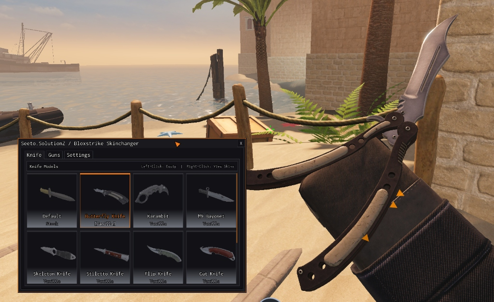
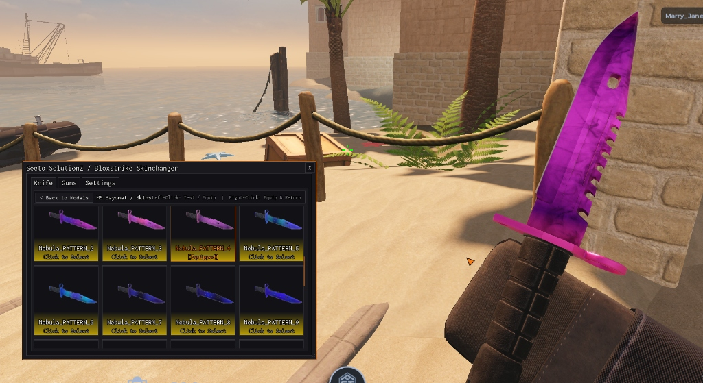

# Seeto.SolutionZ / Bloxstrike Skinchanger

> Lightweight standalone skinchanger and knife engine for Bloxstrike.

## Loadstring

```lua
loadstring(game:HttpGet("https://raw.githubusercontent.com/euphonee/Seeto.Solutionz-Bloxstrike-Skinchanger/main/init.lua"))()
```

## Previews




## Features

- **Knives**: Custom knife models (Butterfly, Karambit, M9 Bayonet, Skeleton, etc.) & skins.
- **Weapons**: Custom viewmodel skins for all 26 firearms.
- **Presets**: Top-tier special skins, random with per-round re-rolls, stock defaults.
- **Headless API**: Simple `_G.SkinChanger` API ready for custom UIs and scripts.
- **Config**: Auto-saving json config (`Bloxstrike_Skinchanger.json`).

## API Quickstart

```lua
local SkinChanger = _G.SkinChanger

-- knives & weapons
SkinChanger.setKnife("Butterfly Knife", "Fade")
SkinChanger.setWeaponSkin("AK-47", "Midas")

-- batch presets
SkinChanger.setAllSpecial()
SkinChanger.setAllRandom()
SkinChanger.setAllDefault()

-- refresh / reroll
SkinChanger.rerollRandom()
SkinChanger.refresh()
```
